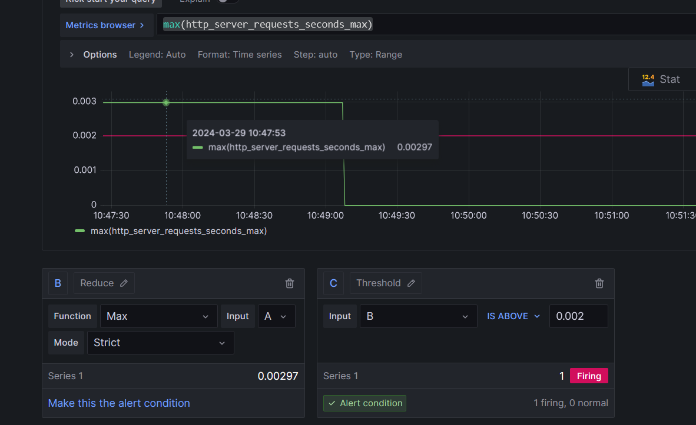

<a href="https://crossvale.com">
      <noscript></noscript></a>

# XV OCP Pipelines Workshop

The purpose of this workshop is to provide an overview on how to build, deploy and monitor applications running in an Openshift cluster.

To build the applications, *Openshift Pipelines* will be used and the deployment will be done by *Openshift GitOps*.

The configuration management is based on `Helm` and `Kustomize` while the monitoring and alerting of application metrics is done using `Grafana` and `Prometheus`.

# Lab 0 Prepare OCP Cluster for Workshop

The purpose of this Lab is to prepare the Openshift cluster for the exercises.

<svg class="octicon octicon-info mr-2" viewBox="0 0 16 16" version="1.1" width="16" height="16" aria-hidden="true"><path d="M0 8a8 8 0 1 1 16 0A8 8 0 0 1 0 8Zm8-6.5a6.5 6.5 0 1 0 0 13 6.5 6.5 0 0 0 0-13ZM6.5 7.75A.75.75 0 0 1 7.25 7h1a.75.75 0 0 1 .75.75v2.75h.25a.75.75 0 0 1 0 1.5h-2a.75.75 0 0 1 0-1.5h.25v-2h-.25a.75.75 0 0 1-.75-.75ZM8 6a1 1 0 1 1 0-2 1 1 0 0 1 0 2Z"></path></svg>Note

  
This lab is optional and must only be done by the instructor.

## Lab 0.1 Install Openshift Pipelines Operator

Install the pipelines operator from the OperatorHub:

* Name: 
* Version:

## Lab 0.2 Install Openshift GitOps Operator

## Lab 0.3 Install Grafana Operator

## Lab 0.4 Configure Service Account Permissions

# Lab 1

Set your personal details for the script:

Git Repo: <input type="text" id="gitRepo" name="gitRepo" value="https://github.com/crossvale-inc/ocp-pipelines"/>

UserName: <input type="text" id="username" name="name" />

<input type="button" value="generate" onClick="window.location.reload()"/>

Clone the repository in your workspace:

<pre>git clone </pre>

Create the develop project:

<pre>oc create project </pre>

Create the test project:

<pre>oc create project </pre>

