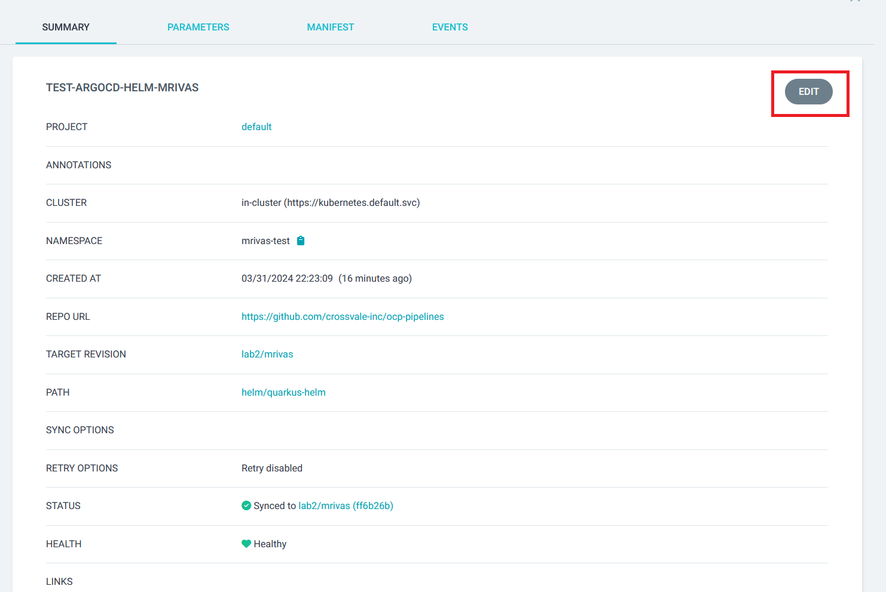
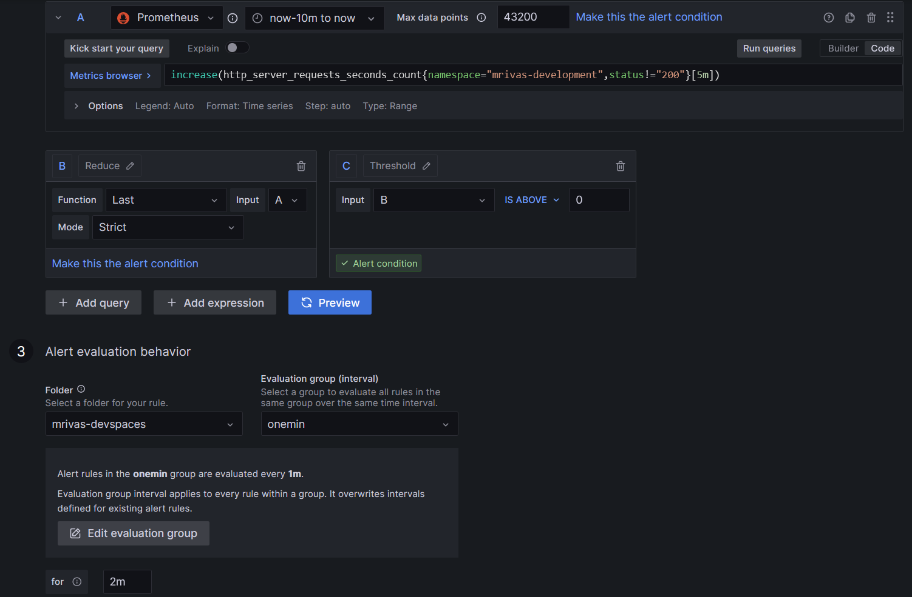
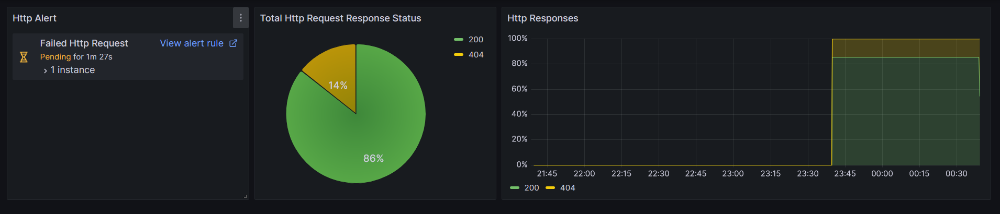

<style>
  
  input[type=text], select, textarea {
    width: 100%;
    padding: 12px;
    border: 1px solid #ccc;
    border-radius: 4px;
    resize: vertical;
  }

  input[type=button] {
    background-color: #F50000;
    color: white;
    padding: 12px 20px;
    border: none;
    border-radius: 4px;
    cursor: pointer;
    
  }

  input[type=button]:hover {
    background-color: #751515;
  }
  
  .header {
    padding: 10px 16px;
    background: #ffffff;
  }

  .markdown-body .headerlink {
    color: #751515;
  }

  .sticky {
    position: fixed;
    top: 0;
    width: 100%;
  }

  .mr-2 {
    margin-right: var(--base-size-8, 8px) !important;
  }

  .octicon {
    display: inline-block;
    overflow: visible !important;
    vertical-align: text-bottom;
    fill: currentColor;
  }

  .markdown-alert {
    padding-left: 16px;
    margin-bottom: 16px;
    color: inherit;
  }

  .markdown-alert-title {
    display: flex;
    font-weight: var(--base-text-weight-medium, 500);
    align-items: center;
    line-height: 1;
  }

  .markdown-alert-note {
    border-left: .25em solid #1f6feb;
    border-left-color: #1f6feb;
    color: #1f6feb;
  }

  .markdown-alert-caution {
    border-left: .25em solid #da3633;
    border-left-color: #da3633;
    color: #da3633;
  }

  .markdown-alert-important {
    border-left: .25em solid #8957e5;
    border-left-color: #8957e5;
    color: #8957e5;
  }


</style>

<div class="header" id="xvHeader">
<a href="https://crossvale.com">
      <noscript></noscript></a>
</div>

# XV OCP Pipelines Workshop

The purpose of this workshop is to provide an overview on how to build, deploy and monitor applications running in an Openshift cluster.

To build the applications, *Openshift Pipelines* will be used and the deployment will be done by *Openshift GitOps*.

The configuration management is based on `Helm` and `Kustomize` while the monitoring and alerting of application metrics is done using `Grafana` and `Prometheus`.

## Lab 0 Prepare OCP Cluster for Workshop

The purpose of this Lab is to prepare the Openshift cluster for the exercises.

<div class="markdown-alert markdown-alert-note" dir="auto"><p class="markdown-alert-title" dir="auto"><svg class="octicon octicon-info mr-2" viewBox="0 0 16 16" version="1.1" width="16" height="16" aria-hidden="true"><path d="M0 8a8 8 0 1 1 16 0A8 8 0 0 1 0 8Zm8-6.5a6.5 6.5 0 1 0 0 13 6.5 6.5 0 0 0 0-13ZM6.5 7.75A.75.75 0 0 1 7.25 7h1a.75.75 0 0 1 .75.75v2.75h.25a.75.75 0 0 1 0 1.5h-2a.75.75 0 0 1 0-1.5h.25v-2h-.25a.75.75 0 0 1-.75-.75ZM8 6a1 1 0 1 1 0-2 1 1 0 0 1 0 2Z"></path></svg>Note</p>
  <p dir="auto">This lab is optional and must only be done by the instructor.</p>
</div>

### Lab 0.1 Install Openshift Pipelines Operator

Install the pipelines operator from the OperatorHub:

* Name: Red Hat OpenShift Pipelines
* Version: 1.14.3 provided by Red Hat


Click `Install`, select default options and wait until the operator is installed.

### Lab 0.2 Install Openshift GitOps Operator

Install the GitOps operator from the OperatorHub:

* Name: Red Hat OpenShift Pipelines
* Version: 1.12.0 provided by Red Hat Inc


Click `Install`, select default options and wait until the operator is installed.

Optionally, add `admin` role to all users logged to `ArgoCD` if needed for this workshop. Add the following line to the `ArgoCD` YAML located in the `openshift-gitops` namespace:

<div class="markdown-alert markdown-alert-caution" dir="auto"><p class="markdown-alert-title" dir="auto"><svg class="octicon octicon-stop mr-2" viewBox="0 0 16 16" version="1.1" width="16" height="16" aria-hidden="true"><path d="M4.47.22A.749.749 0 0 1 5 0h6c.199 0 .389.079.53.22l4.25 4.25c.141.14.22.331.22.53v6a.749.749 0 0 1-.22.53l-4.25 4.25A.749.749 0 0 1 11 16H5a.749.749 0 0 1-.53-.22L.22 11.53A.749.749 0 0 1 0 11V5c0-.199.079-.389.22-.53Zm.84 1.28L1.5 5.31v5.38l3.81 3.81h5.38l3.81-3.81V5.31L10.69 1.5ZM8 4a.75.75 0 0 1 .75.75v3.5a.75.75 0 0 1-1.5 0v-3.5A.75.75 0 0 1 8 4Zm0 8a1 1 0 1 1 0-2 1 1 0 0 1 0 2Z"></path></svg>Caution</p>
  <p dir="auto">Do this only for workshop purposes in a controlled environment.</p>
</div>

```
spec:
  rbac:
    defaultPolicy: 'role:admin'
```

### Lab 0.3 Install Grafana Operator

Create a namespace for the Grafana operator:

```
oc new-project grafana-operator
```

Install the Grafana operator the OperatorHub:

* Name: Grafana Operator
* Version: 5.8.0 provided by Grafana Labs


Install the grafana operator in the created project:


Click `Install`, and wait until the operator is installed.

### Lab 0.4 Enable User Workload Monitoring

Enable user workload monitoring so it is possible to collect metrics from application containers:

```
apiVersion: v1
kind: ConfigMap
metadata:
  name: cluster-monitoring-config
  namespace: openshift-monitoring
data:
  config.yaml: |
    enableUserWorkload: true
```

## Generate Your Own Script

Set your personal details for the script:

Image Registry: <input type="text" id="imageRegistry" name="imageRegistry" value="image-registry.openshift-image-registry.svc:5000"/> 

Git Repo: <input type="text" id="gitRepo" name="gitRepo" value="https://github.com/crossvale-inc/ocp-pipelines"/>

Default Git Branch: <input type="text" id="gitBranch" name="gitBranch" value="main"/>

UserName: <input type="text" id="username" name="name" value="user"/>

<input type="button" value="generate" onClick="window.location.reload()"/>

<script>

  var username= document.getElementById("username").value
  var gitRepo= document.getElementById("gitRepo").value
  var gitBranch= document.getElementById("gitBranch").value

  var gitConfigRepo= document.getElementById("gitRepo").value

  var imageRegistry= document.getElementById("imageRegistry").value

  var workNamespace = username + "-devspaces"
  var devNamespace = username + "-development"
  var testNamespace = username + "-test"

  // When the user scrolls the page, execute myFunction
  window.onscroll = function() {myFunction()};

  // Get the header
  var header = document.getElementById("xvHeader");

  // Get the offset position of the navbar
  var sticky = header.offsetTop;

  // Add the sticky class to the header when you reach its scroll position. Remove "sticky" when you leave the scroll position
  function myFunction() {
    if (window.pageYOffset > sticky) {
      header.classList.add("sticky");
    } else {
      header.classList.remove("sticky");
    }
  } 
</script>

## Student Project Preparation

<div class="markdown-alert markdown-alert-caution" dir="auto"><p class="markdown-alert-title" dir="auto"><svg class="octicon octicon-stop mr-2" viewBox="0 0 16 16" version="1.1" width="16" height="16" aria-hidden="true"><path d="M4.47.22A.749.749 0 0 1 5 0h6c.199 0 .389.079.53.22l4.25 4.25c.141.14.22.331.22.53v6a.749.749 0 0 1-.22.53l-4.25 4.25A.749.749 0 0 1 11 16H5a.749.749 0 0 1-.53-.22L.22 11.53A.749.749 0 0 1 0 11V5c0-.199.079-.389.22-.53Zm.84 1.28L1.5 5.31v5.38l3.81 3.81h5.38l3.81-3.81V5.31L10.69 1.5ZM8 4a.75.75 0 0 1 .75.75v3.5a.75.75 0 0 1-1.5 0v-3.5A.75.75 0 0 1 8 4Zm0 8a1 1 0 1 1 0-2 1 1 0 0 1 0 2Z"></path></svg>Caution</p>
  <p dir="auto">Confirm with your instructor if this needs to be done. This lab may not be required in your case.</p>
</div>

Create the devspace project:

<div class="highlight"><pre>oc new-project <script>document.write(workNamespace)</script></pre>
</div>

Create the development environment project:

<div class="highlight"><pre>oc new-project <script>document.write(devNamespace)</script></pre>
</div>

Create the test environment project:

<div class="highlight"><pre>oc new-project <script>document.write(testNamespace)</script></pre>
</div>

## Lab 1 - Build Pipeline

Clone the repository in your workspace:

<div class="highlight"><pre>git clone <script>document.write(gitRepo)</script></pre>
</div>

In order to build the application image it is necessary to creathe an Openshift Pipeline.

Before continuing, make sure you are in the work namespace in the CLI:

<div class="highlight"><pre>oc project <script>document.write(workNamespace)</script></pre>
</div>

And in the console, search for your `devspaces` namespace and click on its name:


To create the pipeline, click the `+` in the upper right corner of the Openshift console:


And paste the following YAML file:

<div class="highlight"><pre>apiVersion: tekton.dev/v1
kind: Pipeline
metadata:
  name: build-pipeline
spec:
  params:
    - default: <script>document.write(gitBranch)</script>
      name: targetRevision
      type: string
  tasks:
    - name: git-clone
      params:
        - name: url
          value: '<script>document.write(gitRepo)</script>'
        - name: revision
          value: $(params.targetRevision)
        - name: refspec
          value: ''
        - name: submodules
          value: 'true'
        - name: depth
          value: '1'
        - name: sslVerify
          value: 'true'
        - name: crtFileName
          value: ca-bundle.crt
        - name: subdirectory
          value: repo
        - name: sparseCheckoutDirectories
          value: ''
        - name: deleteExisting
          value: 'true'
        - name: httpProxy
          value: ''
        - name: httpsProxy
          value: ''
        - name: noProxy
          value: ''
        - name: verbose
          value: 'true'
        - name: gitInitImage
          value: 'registry.redhat.io/openshift-pipelines/pipelines-git-init-rhel8@sha256:5546aaa01993f7fe6829ac83dbe583dff48b2d33e92144af5e09ee004616117a'
        - name: userHome
          value: /home/git
      taskRef:
        kind: ClusterTask
        name: git-clone
      workspaces:
        - name: output
          workspace: shared-devops
    - name: build-application
      params:
        - name: MAVEN_IMAGE
          value: 'registry.redhat.io/ubi8/openjdk-17@sha256:a8165bc2cd5051a96d6937e25ed03155bbd4b731da6e58cebfe2ea83209c16d8'
        - name: GOALS
          value:
            - clean
            - package
            - '-Dmaven.repo.local=$(workspaces.maven-settings.path)'
        - name: MAVEN_MIRROR_URL
          value: ''
        - name: SERVER_USER
          value: ''
        - name: SERVER_PASSWORD
          value: ''
        - name: PROXY_USER
          value: ''
        - name: PROXY_PASSWORD
          value: ''
        - name: PROXY_PORT
          value: ''
        - name: PROXY_HOST
          value: ''
        - name: PROXY_NON_PROXY_HOSTS
          value: ''
        - name: PROXY_PROTOCOL
          value: http
        - name: CONTEXT_DIR
          value: repo/order-service
      runAfter:
        - git-clone
      taskRef:
        kind: ClusterTask
        name: maven
      workspaces:
        - name: source
          workspace: shared-devops
        - name: maven-settings
          workspace: maven-settings
    - name: build-image
      params:
        - name: IMAGE
          value: '<script>document.write(imageRegistry)</script>/$(context.pipelineRun.namespace)/order-service:latest'
        - name: BUILDER_IMAGE
          value: 'registry.redhat.io/rhel8/buildah@sha256:b48f410efa0ff8ab0db6ead420a5d8d866d64af846fece5efb185230d7ecf591'
        - name: STORAGE_DRIVER
          value: vfs
        - name: DOCKERFILE
          value: repo/order-service/src/main/docker/Dockerfile.jvm
        - name: CONTEXT
          value: repo/order-service
        - name: TLSVERIFY
          value: 'true'
        - name: FORMAT
          value: oci
        - name: BUILD_EXTRA_ARGS
          value: ''
        - name: PUSH_EXTRA_ARGS
          value: ''
        - name: SKIP_PUSH
          value: 'false'
      runAfter:
        - build-application
      taskRef:
        kind: ClusterTask
        name: buildah
      workspaces:
        - name: source
          workspace: shared-devops
  workspaces:
    - name: shared-devops
    - name: maven-settings
</pre>
</div>

<div class="markdown-alert markdown-alert-important" dir="auto"><p class="markdown-alert-title" dir="auto"><svg class="octicon octicon-report mr-2" viewBox="0 0 16 16" version="1.1" width="16" height="16" aria-hidden="true"><path d="M0 1.75C0 .784.784 0 1.75 0h12.5C15.216 0 16 .784 16 1.75v9.5A1.75 1.75 0 0 1 14.25 13H8.06l-2.573 2.573A1.458 1.458 0 0 1 3 14.543V13H1.75A1.75 1.75 0 0 1 0 11.25Zm1.75-.25a.25.25 0 0 0-.25.25v9.5c0 .138.112.25.25.25h2a.75.75 0 0 1 .75.75v2.19l2.72-2.72a.749.749 0 0 1 .53-.22h6.5a.25.25 0 0 0 .25-.25v-9.5a.25.25 0 0 0-.25-.25Zm7 2.25v2.5a.75.75 0 0 1-1.5 0v-2.5a.75.75 0 0 1 1.5 0ZM9 9a1 1 0 1 1-2 0 1 1 0 0 1 2 0Z"></path></svg>Important</p>
  <p dir="auto">Before importing the pipeline make sure that the selected project is your devspace project.</p>
</div>

Paste the pipeline:


And click the `Create` button.

Since `Openshift Pipelines` is run on containers it is required to create two `PersistentVolumeClaims` to allow to share information between pipeline stages.

Create the following YAML in the `devspace` project:

```
kind: PersistentVolumeClaim
apiVersion: v1
metadata:
  name: maven-settings
spec:
  accessModes:
    - ReadWriteOnce
  resources:
    requests:
      storage: 5Gi
---
kind: PersistentVolumeClaim
apiVersion: v1
metadata:
  name: shared-devops
spec:
  accessModes:
    - ReadWriteOnce
  resources:
    requests:
      storage: 1Gi
```

When the resources are successfully create, go back to the `Pipelines` view in the left menu and select **Pipelines** option and click on **build-pipeline** to see the created pipeline.

To start the pipeline build, click on the **Start** option in the **Actions** section of the pipeline:


Start the pipeline selecting the correct branch and persistent volumes:

<div class="markdown-alert markdown-alert-note" dir="auto"><p class="markdown-alert-title" dir="auto"><svg class="octicon octicon-info mr-2" viewBox="0 0 16 16" version="1.1" width="16" height="16" aria-hidden="true"><path d="M0 8a8 8 0 1 1 16 0A8 8 0 0 1 0 8Zm8-6.5a6.5 6.5 0 1 0 0 13 6.5 6.5 0 0 0 0-13ZM6.5 7.75A.75.75 0 0 1 7.25 7h1a.75.75 0 0 1 .75.75v2.75h.25a.75.75 0 0 1 0 1.5h-2a.75.75 0 0 1 0-1.5h.25v-2h-.25a.75.75 0 0 1-.75-.75ZM8 6a1 1 0 1 1 0-2 1 1 0 0 1 0 2Z"></path></svg>Note</p>
  <p dir="auto">Mind that the git targetRevision may be different in your case.</p>
</div>


Click the `Start` button and wait until the pipeline is finished, it may take some time while downloading all the maven dependencies.

It is possible to check the Pipeline logs in the **Pipeline Runs** tab on the pipeline, then select the run in progress and click **Logs**.

When the pipeline is finished, all steps should be green and the image is pushed to the specified image registry:


It should be possible to check the `ImageStreams` in the console:


It is also possible to check the image stream in the CLI:

<div class="highlight"><pre>oc get is -n <script>document.write(workNamespace)</script></pre>
</div>

## Lab 2 - Deployment to Dev with Helm Charts

Clone the git config repository in the local workspace:

<div class="highlight"><pre>git clone <script>document.write(gitConfigRepo)</script></pre>
</div>

Create a branch to store your local changes:

<div class="highlight"><pre>git checkout -b lab2/<script>document.write(username)</script></pre>
</div>

And push the changes to git

<div class="highlight"><pre>git push --set-upstream origin lab2/<script>document.write(username)</script></pre>
</div>

Create the deployment pipeline by following the same steps as in the build pipeline:

<div class="markdown-alert markdown-alert-important" dir="auto"><p class="markdown-alert-title" dir="auto"><svg class="octicon octicon-report mr-2" viewBox="0 0 16 16" version="1.1" width="16" height="16" aria-hidden="true"><path d="M0 1.75C0 .784.784 0 1.75 0h12.5C15.216 0 16 .784 16 1.75v9.5A1.75 1.75 0 0 1 14.25 13H8.06l-2.573 2.573A1.458 1.458 0 0 1 3 14.543V13H1.75A1.75 1.75 0 0 1 0 11.25Zm1.75-.25a.25.25 0 0 0-.25.25v9.5c0 .138.112.25.25.25h2a.75.75 0 0 1 .75.75v2.19l2.72-2.72a.749.749 0 0 1 .53-.22h6.5a.25.25 0 0 0 .25-.25v-9.5a.25.25 0 0 0-.25-.25Zm7 2.25v2.5a.75.75 0 0 1-1.5 0v-2.5a.75.75 0 0 1 1.5 0ZM9 9a1 1 0 1 1-2 0 1 1 0 0 1 2 0Z"></path></svg>Important</p>
  <p dir="auto">Before importing the pipeline make sure that the selected project is your devspace project.</p>
</div>

<div class="highlight"><pre>apiVersion: tekton.dev/v1
kind: Pipeline
metadata:
  name: deploy-to-dev
spec:
  params:
    - description: Name of the image to be promoted
      name: sourceImage
      type: string
      default: order-service
    - description: Tag of the image to be promoted
      name: sourceImageTag
      type: string
      default: latest
    - description: Name of the ArgoCD application to deploy
      name: applicationToDeploy
      type: string
      default: dev-argocd-helm-<script>document.write(username)</script>
    - description: Build Namespace
      name: buildNamespace
      type: string
      default: <script>document.write(workNamespace)</script>
    - description: Target Namespace
      name: targetNamespace
      type: string
      default: <script>document.write(devNamespace)</script>
  tasks:
    - name: promote-image
      params:
        - name: SCRIPT
          value: 'oc tag $(params.buildNamespace)/$(params.sourceImage):$(params.sourceImageTag) $(params.targetNamespace)/$(params.sourceImage):dev --reference-policy=local'
        - name: VERSION
          value: latest
      taskRef:
        kind: ClusterTask
        name: openshift-client
    - name: deploy-application
      params:
        - name: SCRIPT
          value: |-
            #!/bin/sh

            ARGO_APP=$(params.applicationToDeploy)
            SOURCE_IMAGE=$(params.sourceImage)
            TARGET_NAMESPACE=$(params.targetNamespace)
            SOURCE_IMAGE_TAG=$(params.sourceImageTag)
            SOURCE_IMAGE_NS=$(params.buildNamespace)

            IMAGE_SHA=$(oc get imagestreamtag $SOURCE_IMAGE:$SOURCE_IMAGE_TAG -o jsonpath='{.image.metadata.name}' -n $SOURCE_IMAGE_NS) 

            echo "Deploying application based on image $SOURCE_IMAGE with tag $SOURCE_IMAGE_TAG that points to latest SHA $IMAGE_SHA using $ARGO_APP"

            oc get application $ARGO_APP -n openshift-gitops | grep helm
              
            IS_HELM=$?

            oc get application $ARGO_APP -n openshift-gitops | grep kustomize

            IS_KUSTOMIZE=$?

            if [[ $IS_HELM -eq 0 ]]; then
              
              echo "Applying helm patch"

              oc patch application $ARGO_APP -p '{"operation": {"initiatedBy": {"username": "pipeline"},"sync": {"syncStrategy": null}},"spec":{ "source": {"helm": {"parameters": [{"name": "image.sha","value": "'$IMAGE_SHA'"},{"name": "image.repository","value": "'<script>document.write(imageRegistry)</script>'/'$TARGET_NAMESPACE'/'$SOURCE_IMAGE'"}]}}}}' -n openshift-gitops --type=merge

            elif [[ $IS_KUSTOMIZE -eq 0 ]]; then
              
              echo "Applying kustomize patch"

              oc patch application $ARGO_APP --type='json' -p='[{"op":"replace","path":"/spec/source/kustomize/images/0","value":"quarkus-container-image=<script>document.write(imageRegistry)</script>/'$TARGET_NAMESPACE'/'$SOURCE_IMAGE'@'$IMAGE_SHA'"}]' -n openshift-gitops

              oc patch application $ARGO_APP -p '{"operation": {"initiatedBy": {"username": "pipeline"},"sync": {"syncStrategy": null}}}' -n openshift-gitops --type=merge

            else

              echo "Applying default patch"

              oc patch application $ARGO_APP -p '{"operation": {"initiatedBy": {"username": "pipeline"},"sync": {"syncStrategy": null}}}' -n openshift-gitops --type=merge

            fi
        - name: VERSION
          value: latest
      runAfter:
        - promote-image
      taskRef:
        kind: ClusterTask
        name: openshift-client
</pre>
</div>

The pipeline contains the steps to promthe the image to the development enviroment <script>document.write(devNamespace)</script> and to deploy the application by using  `ArgoCD`. To configure an application, it is necessary to login to `ArgoCD` through the web UI. The hostname is published in the `Route` created by the `Openshift GitOps` Operator:

<div class="markdown-alert markdown-alert-note" dir="auto"><p class="markdown-alert-title" dir="auto"><svg class="octicon octicon-info mr-2" viewBox="0 0 16 16" version="1.1" width="16" height="16" aria-hidden="true"><path d="M0 8a8 8 0 1 1 16 0A8 8 0 0 1 0 8Zm8-6.5a6.5 6.5 0 1 0 0 13 6.5 6.5 0 0 0 0-13ZM6.5 7.75A.75.75 0 0 1 7.25 7h1a.75.75 0 0 1 .75.75v2.75h.25a.75.75 0 0 1 0 1.5h-2a.75.75 0 0 1 0-1.5h.25v-2h-.25a.75.75 0 0 1-.75-.75ZM8 6a1 1 0 1 1 0-2 1 1 0 0 1 0 2Z"></path></svg>Note</p>
  <p dir="auto">If the below command fails, ask your instructor for the ArgoCD URL</p>
</div>

```
oc get route openshift-gitops-server -n openshift-gitops
```

To create the `ArgoCD` application, click on the `Create Application` option in the web UI:


And then click on **EDIT AS YAML** option on the upper right corner:


And paste the following YAML:

<div class="highlight"><pre>apiVersion: argoproj.io/v1alpha1
kind: Application
metadata:
  name: dev-argocd-helm-<script>document.write(username)</script>
spec:
  destination:
    namespace: <script>document.write(devNamespace)</script>
    server: 'https://kubernetes.default.svc'
  project: default
  source:
    path: helm/quarkus-helm
    repoURL: <script>document.write(gitConfigRepo)</script>
    targetRevision: lab2/<script>document.write(username)</script>
    helm:
      releaseName: order-service-helm-<script>document.write(username)</script>
      valueFiles:
      - /helm/dev-order-service-values.yaml</pre>
</div>

Then click **SAVE** and finally **CREATE**.

Validate that the `ArgoCD` application is created. Mind that `ArgoCD` will set the application status to `Missing` and `OutOfSync`, this makes sense since the application was not deployed yet.

To deploy the application, run the `deploy-to-dev` pipeline. Go to the namespace <script>document.write(workNamespace)</script> and run the `deploy-to-dev` pipeline. Validate that the values are correct:


<div class="markdown-alert markdown-alert-note" dir="auto"><p class="markdown-alert-title" dir="auto"><svg class="octicon octicon-info mr-2" viewBox="0 0 16 16" version="1.1" width="16" height="16" aria-hidden="true"><path d="M0 8a8 8 0 1 1 16 0A8 8 0 0 1 0 8Zm8-6.5a6.5 6.5 0 1 0 0 13 6.5 6.5 0 0 0 0-13ZM6.5 7.75A.75.75 0 0 1 7.25 7h1a.75.75 0 0 1 .75.75v2.75h.25a.75.75 0 0 1 0 1.5h-2a.75.75 0 0 1 0-1.5h.25v-2h-.25a.75.75 0 0 1-.75-.75ZM8 6a1 1 0 1 1 0-2 1 1 0 0 1 0 2Z"></path></svg>Note</p>
  <p dir="auto">If the pipeline fails due to permission problems
    <br>Be sure that the permissions of the involved service accounts are correct.
    <br>Execute the commands: <pre>oc adm policy add-role-to-user edit system:serviceaccount:<script>document.write(workNamespace)</script>:pipeline -n <script>document.write(devNamespace)</script>
oc adm policy add-role-to-user edit system:serviceaccount:<script>document.write(workNamespace)</script>:pipeline -n openshift-gitops
oc adm policy add-role-to-user edit system:serviceaccount:openshift-gitops:openshift-gitops-argocd-application-controller -n <script>document.write(devNamespace)</script></pre> To add the required permissions</p>
</div>

Once the pipeline is finished, `ArgoCD` will change the application status to `Healthy` and `Sync`:


Although `ArgoCD` is reporting the application as `Healthy` and that means that the pod is running correctly, it is possible to validate that the application is running manually. Execute a curl, from any pod within the cluster to the service endpoint and expect to recevied a *HTTP 200* and an empty array as response:

<div class="highlight"><pre>curl -v http://order-service-helm-<script>document.write(username)</script>-quarkus-helm.<script>document.write(devNamespace)</script>:8080/entity/orders</pre>
</div>

<div class="markdown-alert markdown-alert-note" dir="auto"><p class="markdown-alert-title" dir="auto"><svg class="octicon octicon-info mr-2" viewBox="0 0 16 16" version="1.1" width="16" height="16" aria-hidden="true"><path d="M0 8a8 8 0 1 1 16 0A8 8 0 0 1 0 8Zm8-6.5a6.5 6.5 0 1 0 0 13 6.5 6.5 0 0 0 0-13ZM6.5 7.75A.75.75 0 0 1 7.25 7h1a.75.75 0 0 1 .75.75v2.75h.25a.75.75 0 0 1 0 1.5h-2a.75.75 0 0 1 0-1.5h.25v-2h-.25a.75.75 0 0 1-.75-.75ZM8 6a1 1 0 1 1 0-2 1 1 0 0 1 0 2Z"></path></svg>Note</p>
  <p dir="auto">Since <strong>devspaces</strong> is running inside the cluster, it is possible to execute the curl from the IDE terminal.</p>
</div>

Now, try to add a `Route` object to the provided helm chart. 

To do that, add the following yaml inside the folder `helm/quarkus-helm/templates` folder of your git repository branch and name it **route.yaml**:

```
kind: Route
apiVersion: route.openshift.io/v1
metadata:
  name: {{ include "quarkus-helm.fullname" . }}
  labels:
    {{- include "quarkus-helm.labels" . | nindent 4 }}
spec:
  to:
    kind: Service
    name: {{ include "quarkus-helm.fullname" . }}
    weight: 100
  port:
    targetPort: http
  wildcardPolicy: None
```

Commit and push your change and wait until `ArgoCD` detects the application as `OutOfSync`:


Click the **SYNC** and then **SYNCRHONIZE** button of the application and wait until `ArgoCD` reports the applications as `Synced` again.

Validate that a route has been created in the dev namespace:

<div class="highlight"><pre>oc get routes -n <script>document.write(devNamespace)</script></pre>
</div>

Try to execute a `curl` to the route endpoint to retrieve the `/entity/orders` and validate that it returns a *HTTP 200* and an empty array.

## Lab 3 - Deployment to Test with Helm Charts

The deployment to test is done following the same principles as the deployment on dev.

Create a `deploy-to-test` pipeline by importing the following yaml in your namespace <script>document.write(workNamespace)</script>:

<div class="markdown-alert markdown-alert-important" dir="auto"><p class="markdown-alert-title" dir="auto"><svg class="octicon octicon-report mr-2" viewBox="0 0 16 16" version="1.1" width="16" height="16" aria-hidden="true"><path d="M0 1.75C0 .784.784 0 1.75 0h12.5C15.216 0 16 .784 16 1.75v9.5A1.75 1.75 0 0 1 14.25 13H8.06l-2.573 2.573A1.458 1.458 0 0 1 3 14.543V13H1.75A1.75 1.75 0 0 1 0 11.25Zm1.75-.25a.25.25 0 0 0-.25.25v9.5c0 .138.112.25.25.25h2a.75.75 0 0 1 .75.75v2.19l2.72-2.72a.749.749 0 0 1 .53-.22h6.5a.25.25 0 0 0 .25-.25v-9.5a.25.25 0 0 0-.25-.25Zm7 2.25v2.5a.75.75 0 0 1-1.5 0v-2.5a.75.75 0 0 1 1.5 0ZM9 9a1 1 0 1 1-2 0 1 1 0 0 1 2 0Z"></path></svg>Important</p>
  <p dir="auto">Before importing the pipeline make sure that the selected project is your devspace project.</p>
</div>

<div class="highlight"><pre>apiVersion: tekton.dev/v1
kind: Pipeline
metadata:
  name: deploy-to-test
spec:
  params:
    - description: Name of the image to be promoted
      name: sourceImage
      type: string
      default: order-service
    - description: Tag of the image to be promoted
      name: sourceImageTag
      type: string
      default: dev
    - description: Name of the ArgoCD application to deploy
      name: applicationToDeploy
      type: string
      default: test-argocd-helm-<script>document.write(username)</script>
    - description: Build Namespace
      name: sourceNamespace
      type: string
      default: <script>document.write(devNamespace)</script>
    - description: Target Namespace
      name: targetNamespace
      type: string
      default: <script>document.write(testNamespace)</script>
  tasks:
    - name: promote-image
      params:
        - name: SCRIPT
          value: 'oc tag $(params.sourceNamespace)/$(params.sourceImage):$(params.sourceImageTag) $(params.targetNamespace)/$(params.sourceImage):test --reference-policy=local'
        - name: VERSION
          value: latest
      taskRef:
        kind: ClusterTask
        name: openshift-client
    - name: deploy-application
      params:
        - name: SCRIPT
          value: |-
            #!/bin/sh

            ARGO_APP=$(params.applicationToDeploy)
            SOURCE_IMAGE=$(params.sourceImage)
            TARGET_NAMESPACE=$(params.targetNamespace)
            SOURCE_IMAGE_TAG=$(params.sourceImageTag)
            SOURCE_IMAGE_NS=$(params.sourceNamespace)

            IMAGE_SHA=$(oc get imagestreamtag $SOURCE_IMAGE:$SOURCE_IMAGE_TAG -o jsonpath='{.image.metadata.name}' -n $SOURCE_IMAGE_NS) 

            echo "Deploying application based on image $SOURCE_IMAGE with tag $SOURCE_IMAGE_TAG that points to latest SHA $IMAGE_SHA using $ARGO_APP"
            
            oc get application $ARGO_APP -n openshift-gitops | grep helm
              
            IS_HELM=$?

            oc get application $ARGO_APP -n openshift-gitops | grep kustomize

            IS_KUSTOMIZE=$?

            if [[ $IS_HELM -eq 0 ]]; then
              
              echo "Applying helm patch"

              oc patch application $ARGO_APP -p '{"spec":{ "source": {"helm": {"parameters": [{"name": "image.sha","value": "'$IMAGE_SHA'"},{"name": "image.repository","value": "'<script>document.write(imageRegistry)</script>'/'$TARGET_NAMESPACE'/'$SOURCE_IMAGE'"}]}}}}' -n openshift-gitops --type=merge

            elif [[ $IS_KUSTOMIZE -eq 0 ]]; then
              
              echo "Applying kustomize patch"

              oc patch application $ARGO_APP --type='json' -p='[{"op":"replace","path":"/spec/source/kustomize/images/0","value":"quarkus-container-image=<script>document.write(imageRegistry)</script>/'$TARGET_NAMESPACE'/'$SOURCE_IMAGE'@'$IMAGE_SHA'"}]' -n openshift-gitops

              oc patch application $ARGO_APP -p '{"operation": {"initiatedBy": {"username": "pipeline"},"sync": {"syncStrategy": null}}}' -n openshift-gitops --type=merge

            else

              echo "Applying default patch"

              oc patch application $ARGO_APP -p '{"operation": {"initiatedBy": {"username": "pipeline"},"sync": {"syncStrategy": null}}}' -n openshift-gitops --type=merge

            fi
        - name: VERSION
          value: latest
      runAfter:
        - promote-image
      taskRef:
        kind: ClusterTask
        name: openshift-client
</pre></div>

Now create a new `ArgoCD` application to execute the deployment to the test namespace:

<div class="highlight"><pre>apiVersion: argoproj.io/v1alpha1
kind: Application
metadata:
  name: test-argocd-helm-<script>document.write(username)</script>
spec:
  destination:
    namespace: <script>document.write(testNamespace)</script>
    server: 'https://kubernetes.default.svc'
  project: default
  source:
    path: helm/quarkus-helm
    repoURL: <script>document.write(gitRepo)</script>
    targetRevision: lab2/<script>document.write(username)</script>
    helm:
      releaseName: order-service-helm-<script>document.write(username)</script>
      valueFiles:
      - /helm/test-order-service-values.yaml
</pre></div>

As with the dev application, `ArgoCD` will report the application as `Missing` and `OutOfSync`.

Execute the `deploy-to-test` pipeline to promote the application to the <script>document.write(testNamespace)</script> namespace, validate that the values are correct.

<div class="markdown-alert markdown-alert-note" dir="auto"><p class="markdown-alert-title" dir="auto"><svg class="octicon octicon-info mr-2" viewBox="0 0 16 16" version="1.1" width="16" height="16" aria-hidden="true"><path d="M0 8a8 8 0 1 1 16 0A8 8 0 0 1 0 8Zm8-6.5a6.5 6.5 0 1 0 0 13 6.5 6.5 0 0 0 0-13ZM6.5 7.75A.75.75 0 0 1 7.25 7h1a.75.75 0 0 1 .75.75v2.75h.25a.75.75 0 0 1 0 1.5h-2a.75.75 0 0 1 0-1.5h.25v-2h-.25a.75.75 0 0 1-.75-.75ZM8 6a1 1 0 1 1 0-2 1 1 0 0 1 0 2Z"></path></svg>Note</p>
  <p dir="auto">If the pipeline fails due to permission problems
    <br>Be sure that the permissions of the involved service accounts are correct.
    <br>Execute the commands: <pre>oc adm policy add-role-to-user edit system:serviceaccount:<script>document.write(workNamespace)</script>:pipeline -n <script>document.write(testNamespace)</script>
oc adm policy add-role-to-user edit system:serviceaccount:<script>document.write(workNamespace)</script>:pipeline -n openshift-gitops
oc adm policy add-role-to-user edit system:serviceaccount:openshift-gitops:openshift-gitops-argocd-application-controller -n <script>document.write(testNamespace)</script></pre> To add the required permissions</p>
</div>

When the pipeline is run, check the `ArgoCD` status:


Mind that even with a successful pipeline, the application has not being deployed. This is because the pipeline is configured only to promote the image and update `ArgoCD` reference to that image. 

To deploy to test, syncrhonize the `ArgoCD` test application manually and wait until the application is reported as `Healthy` and Synced. 

Now, try to execute a curl to the application in the test environment:

<div class="highlight"><pre>curl -v http://order-service-helm-<script>document.write(username)</script>-quarkus-helm.<script>document.write(testNamespace)</script>:8080/entity/orders</pre>
</div>

The deployment to test requires manuall synchronization in argo, this is because the pipeline is not configured to automatically send the synchronize order to `ArgoCD`. 

However, it is also possible to configure `ArgoCD` to automatically synchronize an application when it is detected as `OutOfSync`.

To do that, click on your `ArgoCD` application for test and go to the detail view and click on the **EDIT** option in the upper right corner:



Scroll down to the **SYNC POLICY** section and click **ENABLE AUTO-SYNC** with the **PRUNE** OPTION ENABLED.


To test the auto synchronization provided by `ArgoCD`, delete the `route.yaml` file created in the previous lab:

```
rm helm/quarkus-helm/templates/route.yaml
```

Commit and push your changes and observe how the route is deleted automatically by `ArgoCD` after the application is detected as `OutOfSync`.

<div class="markdown-alert markdown-alert-note" dir="auto"><p class="markdown-alert-title" dir="auto"><svg class="octicon octicon-info mr-2" viewBox="0 0 16 16" version="1.1" width="16" height="16" aria-hidden="true"><path d="M0 8a8 8 0 1 1 16 0A8 8 0 0 1 0 8Zm8-6.5a6.5 6.5 0 1 0 0 13 6.5 6.5 0 0 0 0-13ZM6.5 7.75A.75.75 0 0 1 7.25 7h1a.75.75 0 0 1 .75.75v2.75h.25a.75.75 0 0 1 0 1.5h-2a.75.75 0 0 1 0-1.5h.25v-2h-.25a.75.75 0 0 1-.75-.75ZM8 6a1 1 0 1 1 0-2 1 1 0 0 1 0 2Z"></path></svg>Note</p>
  <p dir="auto">Mind that it can take some time for the changes to be detected and applied</p>
</div>

Validate that the route is now deleted:

<div class="highlight"><pre>oc get routes -n <script>document.write(testNamespace)</script></pre>
</div>

With this configuration `ArgoCD` will synchronize automatically the changes on the git repository to the application status on the cluster but it is also possible for `ArgoCD` to recreate resources if those are deleted in the cluster. 

Delete the application deployment from your test namespace:

<div class="highlight"><pre>oc delete deployment order-service-helm-<script>document.write(username)</script>-quarkus-helm -n <script>document.write(testNamespace)</script></pre>
</div>

ArgoCD will detect the application changes made in the cluster but it will not enforce the application status by default.

Enable the **SELF HEAL** option in the `ArgoCD` application **SYNC POLICY** and wait until the application is synchronized.

Delete the deployment again:

<div class="highlight"><pre>oc delete deployment order-service-helm-<script>document.write(username)</script>-quarkus-helm -n <script>document.write(testNamespace)</script></pre>
</div>

And wait until `ArgoCD` heals the application by recreating the deployment.

<div class="markdown-alert markdown-alert-important" dir="auto"><p class="markdown-alert-title" dir="auto"><svg class="octicon octicon-report mr-2" viewBox="0 0 16 16" version="1.1" width="16" height="16" aria-hidden="true"><path d="M0 1.75C0 .784.784 0 1.75 0h12.5C15.216 0 16 .784 16 1.75v9.5A1.75 1.75 0 0 1 14.25 13H8.06l-2.573 2.573A1.458 1.458 0 0 1 3 14.543V13H1.75A1.75 1.75 0 0 1 0 11.25Zm1.75-.25a.25.25 0 0 0-.25.25v9.5c0 .138.112.25.25.25h2a.75.75 0 0 1 .75.75v2.19l2.72-2.72a.749.749 0 0 1 .53-.22h6.5a.25.25 0 0 0 .25-.25v-9.5a.25.25 0 0 0-.25-.25Zm7 2.25v2.5a.75.75 0 0 1-1.5 0v-2.5a.75.75 0 0 1 1.5 0ZM9 9a1 1 0 1 1-2 0 1 1 0 0 1 2 0Z"></path></svg>Important</p>
  <p dir="auto">Before continuing, delete the created ArgoCD applications</p>
</div>

# Monitoring Labs

## Lab 1 Monitor an Application

Deploy the `order-service` application in the development namespace but this time use the kustomize `ArgoCD` application instead of the `Helm` application. Create the `ArgoCD` application:

<div class="highlight"><pre>
apiVersion: argoproj.io/v1alpha1
kind: Application
metadata:
  name: dev-argocd-kustomize-<script>document.write(username)</script>
spec:
  destination:
    namespace: <script>document.write(devNamespace)</script>
    server: 'https://kubernetes.default.svc'
  project: default
  source:
    kustomize:
      images:
      - quarkus-container-image=<script>document.write(imageRegistry)</script>/<script>document.write(devNamespace)</script>/order-service:dev
      namespace: <script>document.write(devNamespace)</script>
    path: kustomize/overlays/order-service/environments/dev
    repoURL: >-
      <script>document.write(gitRepo)</script>
    targetRevision: <script>document.write(gitBranch)</script>
</pre></div>

Run the `deploy-to-dev` pipeline but this time select the kustomize `ArgoCD` application:


Wait until the `ArgoCD` application is synchronized.

It is possible to check the application logs from the Openshift console.

In the **Developer** view, click on **Topology** and two deployments should be shown. Click on the named: **orders-service-kustomize** and then on the pod and is shown:


In the `Pod` view select the **Logs** tab to view the pod logs:


It is also possible to check the deployment logs by executing the following command:

<div class="highlight"><pre>
oc logs -f deployment/order-service-kustomize -n <script>document.write(devNamespace)</script>
</pre></div>

It is also possible to check the pod logs using the same command:

<div class="markdown-alert markdown-alert-note" dir="auto"><p class="markdown-alert-title" dir="auto"><svg class="octicon octicon-info mr-2" viewBox="0 0 16 16" version="1.1" width="16" height="16" aria-hidden="true"><path d="M0 8a8 8 0 1 1 16 0A8 8 0 0 1 0 8Zm8-6.5a6.5 6.5 0 1 0 0 13 6.5 6.5 0 0 0 0-13ZM6.5 7.75A.75.75 0 0 1 7.25 7h1a.75.75 0 0 1 .75.75v2.75h.25a.75.75 0 0 1 0 1.5h-2a.75.75 0 0 1 0-1.5h.25v-2h-.25a.75.75 0 0 1-.75-.75ZM8 6a1 1 0 1 1 0-2 1 1 0 0 1 0 2Z"></path></svg>Note</p>
  <p dir="auto">Replace the placeholder my_podname by your generated pod name.</p>
</div>

<div class="highlight"><pre>
oc logs -f my_podname -n <script>document.write(devNamespace)</script>
</pre></div>

Logs are important to check an application status on the cluster, but it is also possible to configure the Openshift cluster to store application related metrics.

In the Pod view, if you select the **Metrics** tab, some metrics information will be shown:


This metrics are shown at a pod label, that means that the memory or cpu shown in the Pod metrics are the addition of the consumption of all the containers running within that Pod.

These metrics are configured at a cluster level are report information about the container overall resource consumption, but it is also possible to expose custom application metrics to be collected by the cluster metrics component.

The application `order-service` is configured to expose some metrics that can be collected. Go into the application pod terminal and execute the following command:

```
curl http://localhost:8080/q/metrics
```

These shows all the metrics that the application is reporting at this moment. Before continuing, execute the following command from within the application pod terminal (this will execute 5 sequential command to the application exposed operation):

```
for i in {1..5}; do sleep 1 && curl http://localhost:8080/entity/orders; done
```

Since there has been some requests executed in the application, it is possible to check the following metric:

```
curl http://localhost:8080/q/metrics | grep http_server_requests_seconds_count
```

This will show a summary of all the *HTTP* requests processed by that container. For example:

```
$ curl http://localhost:8080/q/metrics | grep http_server_requests_seconds_count
  % Total    % Received % Xferd  Average Speed   Time    Time     Time  Current
                                 Dload  Upload   Total   Spent    Left  Speed
100 16344  100 16344    0     0  1330k      0 --:--:-- --:--:-- --:--:-- 1330k
http_server_requests_seconds_count{method="GET",outcome="CLIENT_ERROR",status="404",uri="NOT_FOUND"} 1.0
http_server_requests_seconds_count{method="GET",outcome="SUCCESS",status="200",uri="/entity/orders"} 6.0
```

To configure the montoring component in the cluster to collect these applications metrics, create the following object in the <script>document.write(devNamespace)</script>

<div class="highlight"><pre>
apiVersion: monitoring.coreos.com/v1
kind: ServiceMonitor
metadata:
  name: order-service-monitor-<script>document.write(username)</script>
spec:
  endpoints:
    - interval: 30s
      path: /q/metrics
      port: 8080-tcp
      scheme: http
  jobLabel: name
  namespaceSelector:
    matchNames:
      - <script>document.write(devNamespace)</script>
  selector:
    matchLabels:
      metrics: quarkus-metrics
</pre></div>

After the service monitor is configured, it should be possible to check the metric value in the **Observe** menu of the Openshift Console:


Since now the metrics are configured to be collected by the cluster, it is possible to configure a custom metrics Dashboards that show the application metrics that are relevant. 

<div class="markdown-alert markdown-alert-note" dir="auto"><p class="markdown-alert-title" dir="auto"><svg class="octicon octicon-info mr-2" viewBox="0 0 16 16" version="1.1" width="16" height="16" aria-hidden="true"><path d="M0 8a8 8 0 1 1 16 0A8 8 0 0 1 0 8Zm8-6.5a6.5 6.5 0 1 0 0 13 6.5 6.5 0 0 0 0-13ZM6.5 7.75A.75.75 0 0 1 7.25 7h1a.75.75 0 0 1 .75.75v2.75h.25a.75.75 0 0 1 0 1.5h-2a.75.75 0 0 1 0-1.5h.25v-2h-.25a.75.75 0 0 1-.75-.75ZM8 6a1 1 0 1 1 0-2 1 1 0 0 1 0 2Z"></path></svg>Note</p>
  <p dir="auto">Mind that all metrics that are collected by the metrics component will be available, not only the application metrics.</p>
</div>

First, deploy your own personal `Grafana` instance in the `devspaces` namespace by importing the following yaml:

<div class="highlight"><pre>
apiVersion: grafana.integreatly.org/v1beta1
kind: Grafana
metadata:
  name: grafana-<script>document.write(username)</script>
  labels:
    dashboards: grafana-<script>document.write(username)</script>
spec:
  route:
    spec: {}
  config:
    log:
      mode: "console"
    auth:
      disable_login_form: "false"
    security:
      admin_user: root
      admin_password: secret
</pre></div>

This will create a new `Grafana` deployment in your personal namespace. Wait until the pod is ready to access the server. 

To check the `Grafana` endpoint execute:

<div class="highlight"><pre>oc get route grafana-<script>document.write(username)</script>-route -n <script>document.write(workNamespace)</script>
</pre></div>

Login to `Grafana` entering `root` as the user and `secret` as the password.

The first step to configure `Grafana` is to integrate the server with the datasource that contains the metrics of the cluster.

Before continuing, collect the token of the service account linked to grafana since it will be needed when configuring the Datasource.

To be the token, execute the following command:

<div class="highlight"><pre>oc get secret | grep grafana-<script>document.write(username)</script>-sa-token | awk '{print "oc get secret "$1" -n <script>document.write(workNamespace)</script> -o jsonpath={.data.token}"}' | bash | base64 -d
</pre></div>

To do this, click on the **Connections** section localted in the hamburguer menu in the upper left corner of the screen:


<div class="markdown-alert markdown-alert-note" dir="auto"><p class="markdown-alert-title" dir="auto"><svg class="octicon octicon-info mr-2" viewBox="0 0 16 16" version="1.1" width="16" height="16" aria-hidden="true"><path d="M0 8a8 8 0 1 1 16 0A8 8 0 0 1 0 8Zm8-6.5a6.5 6.5 0 1 0 0 13 6.5 6.5 0 0 0 0-13ZM6.5 7.75A.75.75 0 0 1 7.25 7h1a.75.75 0 0 1 .75.75v2.75h.25a.75.75 0 0 1 0 1.5h-2a.75.75 0 0 1 0-1.5h.25v-2h-.25a.75.75 0 0 1-.75-.75ZM8 6a1 1 0 1 1 0-2 1 1 0 0 1 0 2Z"></path></svg>Note</p>
  <p dir="auto">Before creating the datasource, ensure that the service account has the expected permission to query the metrics endpoint.
    <br>Execute the commands: <pre>oc adm policy add-cluster-role-to-user cluster-monitoring-view system:serviceaccount:<script>document.write(workNamespace)</script>:grafana-<script>document.write(username)</script>-sa -n <script>document.write(workNamespace)</script></pre> To add the required permissions</p>
</div>


Then clik on **Your Connections** and **Add data source**.

Select **Prometheus** as the datasource type and create it with the following values:
<div class="markdown-alert markdown-alert-important" dir="auto"><p class="markdown-alert-title" dir="auto"><svg class="octicon octicon-report mr-2" viewBox="0 0 16 16" version="1.1" width="16" height="16" aria-hidden="true"><path d="M0 1.75C0 .784.784 0 1.75 0h12.5C15.216 0 16 .784 16 1.75v9.5A1.75 1.75 0 0 1 14.25 13H8.06l-2.573 2.573A1.458 1.458 0 0 1 3 14.543V13H1.75A1.75 1.75 0 0 1 0 11.25Zm1.75-.25a.25.25 0 0 0-.25.25v9.5c0 .138.112.25.25.25h2a.75.75 0 0 1 .75.75v2.19l2.72-2.72a.749.749 0 0 1 .53-.22h6.5a.25.25 0 0 0 .25-.25v-9.5a.25.25 0 0 0-.25-.25Zm7 2.25v2.5a.75.75 0 0 1-1.5 0v-2.5a.75.75 0 0 1 1.5 0ZM9 9a1 1 0 1 1-2 0 1 1 0 0 1 2 0Z"></path></svg>Important</p>
  <p dir="auto">Replace ${GRAFANA_SA_TOKEN_OBTAINED_PREVIOUSLY} with the previously obtained token.</p>
</div>

* HTTP
    * URL: https://thanos-querier.openshift-monitoring.svc.cluster.local:9091
* Auth
    * Skip TLS Verify: true
* Custom HTTP Headers
    * Add a Header:
        * Name: Authorization
        * Value: Bearer ${GRAFANA_SA_TOKEN_OBTAINED_PREVIOUSLY}

The configuration of the datasource should look like the following:


Go to the bottom of the page and click `Save & Test` to create the datasource.

After the datasource is created, it is possible to create a dashboard to check the metrics that are related to the application. 

Create the following yaml in the <script>document.write(workNamespace)</script>:

<div class="highlight"><pre>
apiVersion: grafana.integreatly.org/v1beta1
kind: GrafanaDashboard
metadata:
  labels:
    app: grafana-<script>document.write(username)</script>
  name: metrics-<script>document.write(username)</script>
spec:
  datasources:
    - datasourceName: Prometheus
      inputName: DS_PROMETHEUS
  instanceSelector:
    matchLabels:
      dashboards: grafana-<script>document.write(username)</script> 
  json: |
    {
      "__inputs": [
        {
          "name": "DS_PROMETHEUS",
          "label": "Prometheus",
          "description": "",
          "type": "datasource",
          "pluginId": "prometheus",
          "pluginName": "Prometheus"
        }
      ],
      "__elements": {},
      "__requires": [
        {
          "type": "panel",
          "id": "alertlist",
          "name": "Alert list",
          "version": ""
        },
        {
          "type": "grafana",
          "id": "grafana",
          "name": "Grafana",
          "version": "9.1.6"
        },
        {
          "type": "panel",
          "id": "graph",
          "name": "Graph (old)",
          "version": ""
        },
        {
          "type": "datasource",
          "id": "prometheus",
          "name": "Prometheus",
          "version": "1.0.0"
        },
        {
          "type": "panel",
          "id": "stat",
          "name": "Stat",
          "version": ""
        }
      ],
      "annotations": {
        "list": [
          {
            "builtIn": 1,
            "datasource": {
              "type": "grafana",
              "uid": "-- Grafana --"
            },
            "enable": true,
            "hide": true,
            "iconColor": "rgba(0, 211, 255, 1)",
            "name": "Annotations & Alerts",
            "type": "dashboard"
          }
        ]
      },
      "editable": true,
      "fiscalYearStartMonth": 0,
      "graphTooltip": 0,
      "id": 10,
      "links": [],
      "liveNow": false,
      "panels": [
        {
          "datasource": {
            "type": "prometheus",
            "uid": "${DS_PROMETHEUS}"
          },
          "gridPos": {
            "h": 8,
            "w": 6,
            "x": 0,
            "y": 0
          },
          "id": 3,
          "options": {
            "alertInstanceLabelFilter": "",
            "alertName": "Failed Http Request",
            "dashboardAlerts": false,
            "groupBy": [],
            "groupMode": "default",
            "maxItems": 20,
            "sortOrder": 1,
            "stateFilter": {
              "error": true,
              "firing": true,
              "noData": false,
              "normal": false,
              "pending": true
            },
            "viewMode": "list"
          },
          "title": "Http Alert",
          "type": "alertlist"
        },
        {
          "datasource": {
            "type": "prometheus",
            "uid": "${DS_PROMETHEUS}"
          },
          "fieldConfig": {
            "defaults": {
              "color": {
                "mode": "palette-classic"
              },
              "custom": {
                "hideFrom": {
                  "legend": false,
                  "tooltip": false,
                  "viz": false
                }
              },
              "mappings": []
            },
            "overrides": [
              {
                "matcher": {
                  "id": "byName",
                  "options": "500"
                },
                "properties": [
                  {
                    "id": "color",
                    "value": {
                      "fixedColor": "red",
                      "mode": "fixed"
                    }
                  }
                ]
              }
            ]
          },
          "gridPos": {
            "h": 8,
            "w": 6,
            "x": 6,
            "y": 0
          },
          "id": 1,
          "options": {
            "displayLabels": [
              "percent"
            ],
            "legend": {
              "displayMode": "list",
              "placement": "right",
              "showLegend": true,
              "values": []
            },
            "pieType": "pie",
            "reduceOptions": {
              "calcs": [
                "lastNotNull"
              ],
              "fields": "",
              "values": false
            },
            "tooltip": {
              "mode": "single",
              "sort": "none"
            }
          },
          "targets": [
            {
              "datasource": {
                "type": "prometheus",
                "uid": "${DS_PROMETHEUS}"
              },
              "editorMode": "code",
              "exemplar": false,
              "expr": "sum(http_server_requests_seconds_count{namespace=\"<script>document.write(devNamespace)</script>\"}) by (status)",
              "instant": false,
              "legendFormat": "__auto",
              "range": true,
              "refId": "A"
            }
          ],
          "title": "Total Http Request Response Status",
          "type": "piechart"
        },
        {
          "datasource": {
            "type": "prometheus",
            "uid": "${DS_PROMETHEUS}"
          },
          "fieldConfig": {
            "defaults": {
              "color": {
                "mode": "palette-classic"
              },
              "custom": {
                "axisCenteredZero": false,
                "axisColorMode": "text",
                "axisLabel": "",
                "axisPlacement": "auto",
                "barAlignment": 0,
                "drawStyle": "line",
                "fillOpacity": 23,
                "gradientMode": "none",
                "hideFrom": {
                  "legend": false,
                  "tooltip": false,
                  "viz": false
                },
                "lineInterpolation": "linear",
                "lineWidth": 1,
                "pointSize": 5,
                "scaleDistribution": {
                  "type": "linear"
                },
                "showPoints": "auto",
                "spanNulls": 3600000,
                "stacking": {
                  "group": "A",
                  "mode": "percent"
                },
                "thresholdsStyle": {
                  "mode": "off"
                }
              },
              "mappings": [],
              "noValue": "0",
              "thresholds": {
                "mode": "absolute",
                "steps": [
                  {
                    "color": "green",
                    "value": null
                  },
                  {
                    "color": "red",
                    "value": 80
                  }
                ]
              }
            },
            "overrides": [
              {
                "matcher": {
                  "id": "byName",
                  "options": "500"
                },
                "properties": [
                  {
                    "id": "color",
                    "value": {
                      "fixedColor": "red",
                      "mode": "fixed"
                    }
                  }
                ]
              },
              {
                "matcher": {
                  "id": "byName",
                  "options": "200"
                },
                "properties": [
                  {
                    "id": "color",
                    "value": {
                      "fixedColor": "green",
                      "mode": "fixed"
                    }
                  }
                ]
              }
            ]
          },
          "gridPos": {
            "h": 8,
            "w": 12,
            "x": 12,
            "y": 0
          },
          "id": 2,
          "options": {
            "legend": {
              "calcs": [],
              "displayMode": "list",
              "placement": "bottom",
              "showLegend": true
            },
            "tooltip": {
              "mode": "single",
              "sort": "none"
            }
          },
          "targets": [
            {
              "datasource": {
                "type": "prometheus",
                "uid": "${DS_PROMETHEUS}"
              },
              "editorMode": "code",
              "expr": "sum(http_server_requests_seconds_count{namespace=\"<script>document.write(devNamespace)</script>\"}) by (status)",
              "legendFormat": "__auto",
              "range": true,
              "refId": "A"
            }
          ],
          "title": "Http Responses",
          "type": "timeseries"
        }
      ],
      "refresh": "5s",
      "schemaVersion": 38,
      "style": "dark",
      "tags": [],
      "templating": {
        "list": []
      },
      "time": {
        "from": "now-3h",
        "to": "now"
      },
      "timepicker": {},
      "timezone": "",
      "title": "Http Request Overview",
      "uid": "a61683c7-e9ab-4dfe-bb2e-943f0addfa0f",
      "version": 2,
      "weekStart": ""
    }
</pre></div>

After the dashboard is successfully created, click on the dasboards option in the hamburgue menu on the upper left corner of the `Grafana` UI:


Then click on your <script>document.write(workNamespace)</script> to expand the dashboards section and click on the created dashboard:


You should be able to see the application metrics:


## Lab 2 Configuring Alerts Based on Application Metrics

It is possible configure alerting in `Grafana` by adding some alert rules based on the metrics collected by the cluster.

To do this, select the **Alerting** section on the hamburguer menu on the upper left corner of the `Grafana` UI and click on **Alert Rules**.

Click on **Create alert rule**:


And create an alert named **Failed Http Request** with the following configuration:

<div class="markdown-alert markdown-alert-note" dir="auto"><p class="markdown-alert-title" dir="auto"><svg class="octicon octicon-info mr-2" viewBox="0 0 16 16" version="1.1" width="16" height="16" aria-hidden="true"><path d="M0 8a8 8 0 1 1 16 0A8 8 0 0 1 0 8Zm8-6.5a6.5 6.5 0 1 0 0 13 6.5 6.5 0 0 0 0-13ZM6.5 7.75A.75.75 0 0 1 7.25 7h1a.75.75 0 0 1 .75.75v2.75h.25a.75.75 0 0 1 0 1.5h-2a.75.75 0 0 1 0-1.5h.25v-2h-.25a.75.75 0 0 1-.75-.75ZM8 6a1 1 0 1 1 0-2 1 1 0 0 1 0 2Z"></path></svg>Note</p>
  <p dir="auto">Use <script>document.write(devNamespace)</script> as the value of the namespace filter in the prometheus query.</p>
</div>



Click on **Save and exit** to create the alert. 

This alert, is evaluated each minute by responses that have a *HTTP* status code that is not **200**, to fire the alert execute some invalid request in the application pod:

```
for i in {1..5}; do sleep 1 && curl http://localhost:8080/entity/notfound; done
```

And wait for the alert to be **Pending** which means that the alert rule has been matched:



If the alert is matched two times (since the evaluation behavior is configured to **2m**) it will be set to the status **Firing**:


It is possible to use other metrics for the `Grafana` alert as well as for the dashboards but it is not necessary for the alert metric to be shown in the dashboard to be configured.

Create a new alert based on the response time of the application service to be fired if the response time of the service is bigger than one second.

To do this, configure an alert named **Failed Http Request Response Time** with the following configuration:

<div class="markdown-alert markdown-alert-note" dir="auto"><p class="markdown-alert-title" dir="auto"><svg class="octicon octicon-info mr-2" viewBox="0 0 16 16" version="1.1" width="16" height="16" aria-hidden="true"><path d="M0 8a8 8 0 1 1 16 0A8 8 0 0 1 0 8Zm8-6.5a6.5 6.5 0 1 0 0 13 6.5 6.5 0 0 0 0-13ZM6.5 7.75A.75.75 0 0 1 7.25 7h1a.75.75 0 0 1 .75.75v2.75h.25a.75.75 0 0 1 0 1.5h-2a.75.75 0 0 1 0-1.5h.25v-2h-.25a.75.75 0 0 1-.75-.75ZM8 6a1 1 0 1 1 0-2 1 1 0 0 1 0 2Z"></path></svg>Note</p>
  <p dir="auto">Use <script>document.write(devNamespace)</script> as the value of the namespace filter in the prometheus query.</p>
</div>


Click on **Save and exit** to create the alert. 

To simulate a slow response time, delete the deployment for the orders database:

<div class="highlight"><pre>
oc delete deployment orders -n <script>document.write(devNamespace)</script>
</pre></div>

And execute a valid to the orders endpoint, since there is no database it will take some time to response with a failed status:

```
curl http://localhost:8080/entity/orders
```

When the alert is evaluated, it will be shown as **Pending** in the dashboard:


And since the problem will still be there as the metric evaluated is the maximum response time, it will be set to **Firing** state the next time the alert metric is checked by `Grafana`:


If the evaluation period is passed, and the metrics don't match, the alerts will be cleaned from the dashboard but is is possible to check the response *HTTP* status code over time as shown in the dashboards panel.
